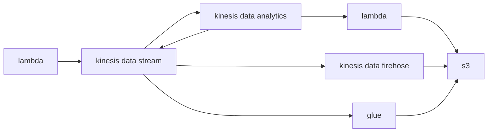

---
categories:
  - 技术
  - 大数据
date: "2024-07-03 19:59:56+08:00"
tags:
  - aws
thumbnailImage: //www.azheimage.top/markdown-img-paste-2019011014402315.png
title: 3. kinesis使用
---

## Amazon Kinesis Data Streams 数据流(可以用 kafka 类比理解)

1. 创建数据流 StockTradeStream
<!--more-->
2. 创建 IAM，[参考文档](https://docs.aws.amazon.com/zh_cn/streams/latest/dev/tutorial-stock-data-kplkcl2-iam.html)
3. 本机 KPL 写入数据
4. 本机 KPL 消费数据并计算

日志看不到，需要额外配置 log4j.properties,以及增加 slf4j-log4j12 的 jar 包
排查日志，发现，需要额外需要 dynamodb 的读写建表权限

示例：

1. 使用 KPL（kinesis producer Library）1.x/2.x（不操作）
2. 使用 Flink（demo）
3. 使用 Lambda（demo）

共享数据流

数据写入：

1. KPL
2. API
3. kinesis agent
4. AWS 部分组件
5. 第三方集成：flink、fluentd、debezium、kafka Connect

读取数据流：

1. AWS Lambda
2. Kinesis Data Analytics
3. Kinesis Data Firehose
4. KCL（Kinesis Consumer Library）1.x/2.x
5. EMR
6. AWS Glue
7. AWS Redshift
8. EventBridge
9. 第三方组件连接器，支持：Flink、Druid、Spark、Kafka、Kinesumer（Go 语言消费客户端）

## Amazon Kinesis Data Analytics(AWS 基于 Flink 封装的实时处理服务)

支持 3 种应用开发：

- SQL 应用程序（旧版）
- Studio 笔记本（Apache flink + zeppelin）
- 流式传输应用程序（Flink Jar）

建议 Flink DataStream API 开发使用流式传输应用，Flink SQL 开发使用 studio

## Amazon Kinesis Data Firehose(输出流)

通过配置化的方式数据同步实时流到其他数据源

### 输入源

#### Direct PUT

选择此选项可创建 Kinesis Data Firehose 传输流，生产者应用程序可直接写入该传输流。目前，以下是 AWS 与 Kinesis Data Firehose 中的 Direct PUT 集成的服务和代理以及开源服务：

- AWS SDK
- AWS Lambda
- AWS 云端监视日志
- AWS 云端观看活动
- AWS 云指标流
- AWS 物联网
- AWSEventbridge
- Amazon SNS
- AWSWAF 网页 ACL 日志
- Amazon API Gateway-访问日志
- Amazon Pinpoint
- Amazon MSK
- Amazon Route 53 Resolver
- AWSNetwork Firewall 警报日志
- AWSNetwork Firewall 流量日志
- 亚马逊 Elasticache Redis 慢点日志
- Kinesis 代理人 (linux)
- Kinesis Tap（窗口）
- Fluentbit
- Fluentd
- Apache Nifi

#### Kinesis data stream

选择此选项可配置使用 Kinesis 数据流作为数据源的 Kinesis Data Firehose 传输流。然后，您可以使用 Kinesis Data Firehose 轻松地从现有 Kinesis 数据流中读取数据并将其加载到目的地。有关使用 Kinesis Data Streams 作为数据源的更多信息，请参阅使用 Kinesis Data Streams 写入亚马逊 Kinesis Data Firehos e。

### 传送流目的地

您的 Kinesis Data Firehose 传输流的目的地。Kinesis Data Firehose 可以发送数据记录到不同的目的地，包括 Amazon Simple Storage Service (Amazon S3)、Amazon OpenSearch Redshift、Amazon Service 以及您或您的任何第三方服务提供商拥有的任何 HTTP 终端节点 以下是支持的目的地：

- 亚马逊 OpenSearch 服务
- 亚马逊 OpenSearch 无服务器
- Amazon Redshift
- Amazon S3
- Coralogix
- Datadog
- Dynatrace
- 灵活应变
- HTTP Endpoint
- 蜂窝
- 逻辑监视器
- Logz.io
- MongoDB
- 新遗物
- Splunk
- Sumo Logic

## Demo

