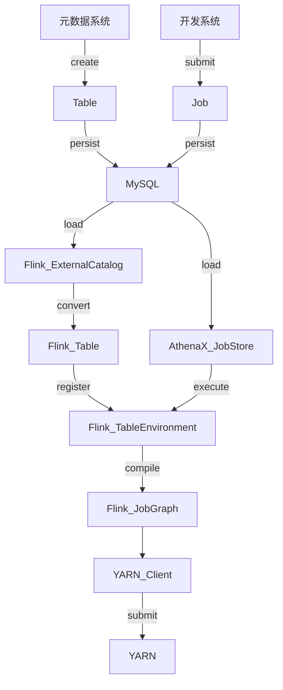
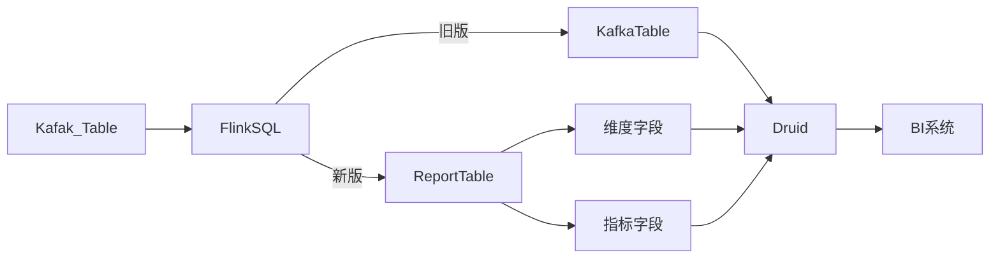

---
categories:
- 技术
- 大数据
date: '2020-04-10 14:21:41+08:00'
tags:
- flink
thumbnailImage: //www.azheimage.top/markdown-img-paste-20180716212442829.png
title: 3-flink平台调研
---
flink相关平台调研
<!--more-->

### 1. 袋鼠云-flinkx
袋鼠云数据同步的插件，提供json配置化的交换任务
#### 功能
- 增量同步、断点续传
- 异构数据源数据同步
- 脏数据管理
- 实时采集
#### 特点：
- 任务构建
- 多通道
- 数据分片
- 流控限速(guava ratelimiter)
- 断点续传
#### 未来规划
- 元数据采集
- 实时采集插件丰富
- 实时采集数据归档

### 2. 网易云-实时数仓
#### 功能
- codegen生成任务
- 元数据中心(metahub参考Netflix的Metacat)
- 实时数仓建设（catalog API转换）（ODS-DWD-DWS-ADS）
- ABTest实时化

### 3. 有赞-flinkSQL应用
#### 功能
- 实时数仓命名规范
- 自定义UDF
- kafka消费组检测机制
- 元数据落库
- SQL语法支持标准输出
- 自定义Connector
#### 规划：
- flink on k8s
  - 任务逻辑
  - docker打包镜像
  - docker镜像仓库
  - k8s创建jobmanager
  - k8s创建taskmanager
  - k8s创建service

- 血缘采集自动化，强化实时数仓及数据图
- k8s开源项目：
1. lyft/flinkk8soperator
2. googlecloudplatform/flink-on-k8s-operator

- 基于Ingress controller解决Flink REST API访问喝WebUI查看问题

### 4. 阿里-flink in AI
#### 功能
- 在线训练
- Ai Flow

### 5. 小米-实时数仓
#### 产品架构：
- 自定义source
- SQL管理
  - WebIDE
  - schema探查
  - UDF/维表join
  - 自动构建DDL
  - SQL编译
  - SQL存储
- Job管理
  - 多版本支持
  - 编译/部署
  - 配置与Jar分离
  - 作业状态管理
- 日志检索:talos+flink+ES
- 监控报警:talos+flink+faicon
- metric展示:talos+flink+druid+grafana
#### 规划：
- 平台化建设
- 数据血缘分析与展示
- 资源优化+动态调度
- Flink社区参与

### 6. 贝壳找房-基于flink实时平台建设（hermes）
#### 功能
- 任务类型：
  - 自定义任务
  - 模板任务
  - 场景任务
- 资源管理：
  - 模板管理
  - 项目管理
  - 连接管理
  - 数据源管理
- 监控：
  - 自定义report
  - java agent
  - 心跳报警
  - 延时报警
- 数据血缘
- checkpoint恢复
- 解析SQL：
  - create function
  - create table
  - create view
  - insert table
- 建表语句
  - source：kafka
  - dim：hbase redis http
  - sink： redis hbase http clickhouse druid
- SQL引擎架构
  - core：SQL解析，SQLcontext，逻辑执行计划
  - factory：序列化，sink，source
  - tableAPI
#### 整体架构：
  - 平台层：SQLIDE，任务管控，监控报警，血缘关系，诊断体系
  - 引擎层：flink
  - 基础层：kafka，yarn，hdfs，离线/实时存储
#### 未来规划：
  - streamSQL：实时ETL、实时大盘监控、实时数仓、实时指标
  - streamCEP（事件驱动）：实时监控报警、实时风控、实时营销、OLEP、实时推荐、微服务整合
  - datastream： 借助API实时处理流式数据
  - streamML：基于流计算的机器学习平台

### 7. 菜鸟-实时数据技术架构
#### 功能
- autoscaling
- 天工，统一数据服务
- 跨数据源查询：
  - SQL Parser
  - AST Visit
  - Optimizer
  - SQL Rewrite
  - QueryPlan
- 实时压测
- 过程监控
- 资源管理
- 数据质量
#### 规划
流+批+AI

### 8. OPPO-基于flink的实时数仓
#### 功能
- 离线到实时数仓的平滑迁移
  - 实现：hdfs-hive kafka-flink
  - 抽象：
    - 结构：层级，主题
    - 开发：SQL，UDF
    - 管理：元数据系统，权限系统，监控系统
- 实时数仓的层级划分：（ODS-DWD-ADS）
#### 数仓架构

- 改写streamgraph，合并冗余DataSource
- 数据链路自动化

- 延迟监控
- 多租户管理
  - kafka租户，消费速率，生产速率
  - yarn资源
#### 展望：
- 表达能力
- 连接类型
- 开发模板
- 开发规范
- 更细粒度资源监控
- 自动化参数配置
  - Operator Parallelism
  - StateBackend
  - Watermark Interval

### 9. 趣头条-flink+clickhouse 实时数据分析平台
#### 功能
- flink To hive
- flink with clickhouse 
#### 规划：
- connectors SQL
- delta lake（流批存储）

### 10. B站-实时平台架构与实践
#### 功能
- SQL化编程
- DAG拖拽编程
- 一体化托管运维
- 元数据、血缘、权限管理
- 作业运维管理
- 作业调试
#### 架构设计准则
- streaming workflows：语义抽象过程，规范化，json结构
- 让数据说话，输入输出schema化
- streaming SQL通用语法解析层
- 工程效率，IDE开发、运维、监控、告警
#### 未来规划
- 完善SQLIDE开发
- 丰富作业运维
- 模型训练工程化
- 实施特征工程化

### 11. 美团-flink 实时数据分析平台
#### 功能
- 作业配置
  - 作业设置
  - 运行时设置
  - 拓扑结构
- 作业发布
  - 版本管理
  - 编译、发布、回滚
- 作业状态
  - 运行时状态
  - 自定义指标、报警
  - 命令
- 资源管理
  - 多租户隔离
  - 资源交付/部署
#### 实时数仓与传统数仓对比
- 分层方式：更简单
- 数据加工过程
- 实时数据存储
- 维度数据存储
#### 未来规划
- 资源自动调优
- 推动实时数仓建设方式升级

### 12. 字节跳动-flink 实践及优化
#### 功能
- SQL扩展：
  - Source/Sink
  - Dimension：Redis/MySQL
  - Format： Json/protobuf/binlog
  - create：function/view/resource
  - 自定义watermark
  - 计算列
- Task 调度优化
- flink docker 化
- checkpoint使用优化：
  - 默认从上一个chk启动

### 13. 爱奇艺-flink 实时计算平台
#### 需求
- 业务赋能
- 平台化建设
- 统一SQL引擎
- FLink增强
#### 功能
- 监控及报警
  - flink作业数据
  - Job级别指标
  - operator级别
  - task级别
- 状态管理
  - rocksDB做增量checkpoint
- StreamingSQL
  - SQL化
  - DDL：流表、临时表、维度表、结果表
  - UDF
  - SQL IDE
- 文件管理：任务jar包、依赖库
- 函数管理：系统函数，自动以UDF
- 版本管理：任务、文件版本对比及回滚
- 监控大盘、报警订阅、资源审计、异常诊断
- 实时数仓
#### 未来规划
- 流批一体
- SQL化升级
- 基于flink机器学习
- 资源调整
- flink on k8s

