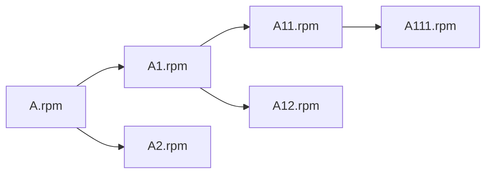

---
categories:
- 技术
- 开发环境
date: 2018-07-24 14:20:38+08:00
tags:
- Linux
thumbnailImage: //www.azheimage.top/markdown-img-paste-20180725103847120.png
title: Linux中shell递归安装软件及依赖包
---
Shell 是一个用 C 语言编写的程序，它是用户使用 Linux 的桥梁。Shell 既是一种命令语言，又是一种程序设计语言。

<!--more-->

本文讲述用shell编写递归，来离线安装软件以及所需的依赖。
思路就是如果安装A.rom,先找到A依赖最底层的依赖，然后依次向上去安装:




```bash
#安装rpm，首先判断是否已经安装了该软件包，如果已经安装，跳过，否则安装
function rpm_exist(){
        #去除vim相关软件安装的判断
    if [[ ! $1 == *vim* ]]
        then
        #去除path路径，保留软件名
        soft="${1##*/}"
        #判断软件是否安装
        if [ `rpm -qa | grep $soft |wc -l` -ne 0 ]
        then
            echo  -e "\033[1;33m[$soft 已经安装，不需要再次安装了]\033[0m"
        else
            #echo  -e "\033[1;33m[$soft 没有安装，准备安装，安装包位置在：$1 ，即将安装...]\033[0m"
            if [[ $1 == *abase-python-devel* ]]
                then
                    #调用安装rpm包，去除后面的rpm，取到安装包的全路径地址：eg：./rpms/httpd-2.4.6-80.el7.centos.1.x86_64
                    rpm -Uvh $1* --nodeps
                else
                    rpm -Uvh $1*
            fi
        fi
    fi
}

#递归查找，查找到依赖最底层先安装，然后再安装最上层目录
function read_dir(){
    for file in `ls $1`  #注意此处这是两个反引号，表示运行系统命令
    do
        #保存新的路径
        path=$1"/"$file
        if [ -d $path ]
            then
                #echo -e "\033[1;32m[读取安装包文件夹:$path]\033[0m"
                read_dir $path
            else
                #判断如果传入的文件是rpm包
                if [[ $path == *rpm ]]
                then
                #调用安装rpm包，去除后面的rpm，取到安装包的全路径地址：eg：./rpms/httpd-2.4.6-80.el7.centos.1.x86_64
                rpm_exist `echo ${path%%.rpm}`
            fi
        fi
    done
}

read_dir $1
```
